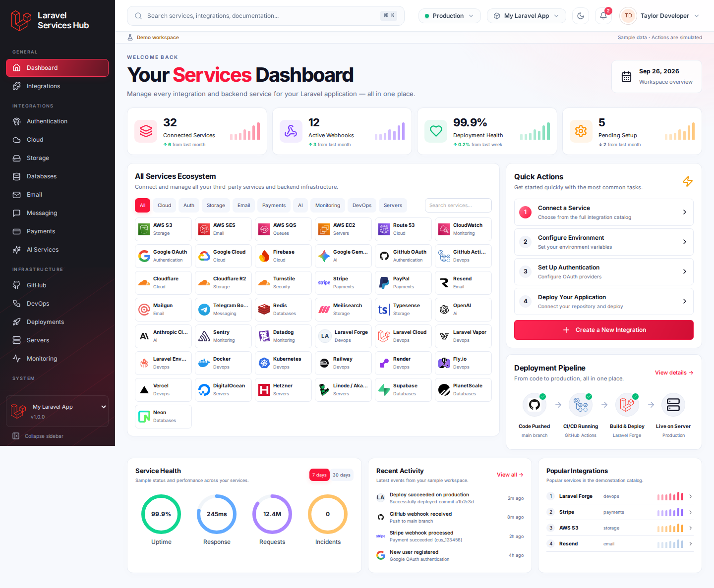
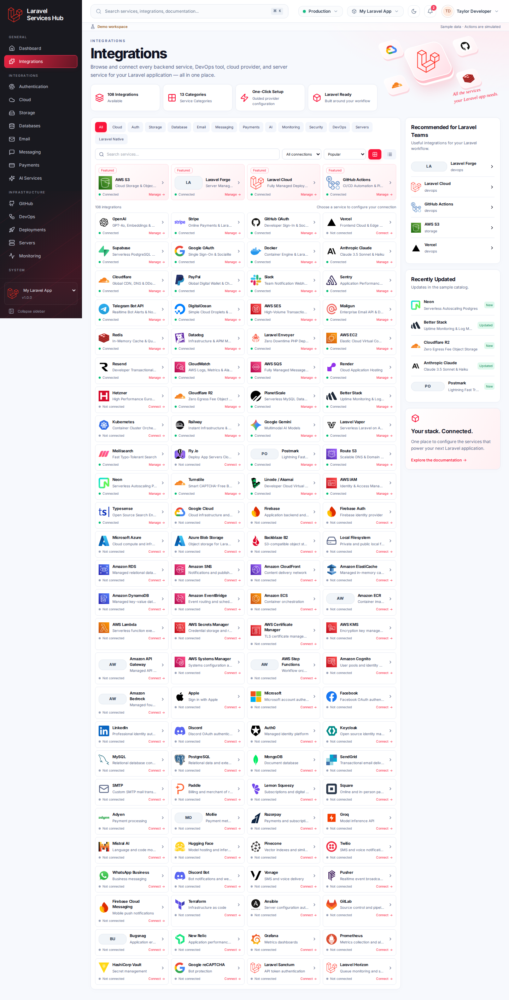
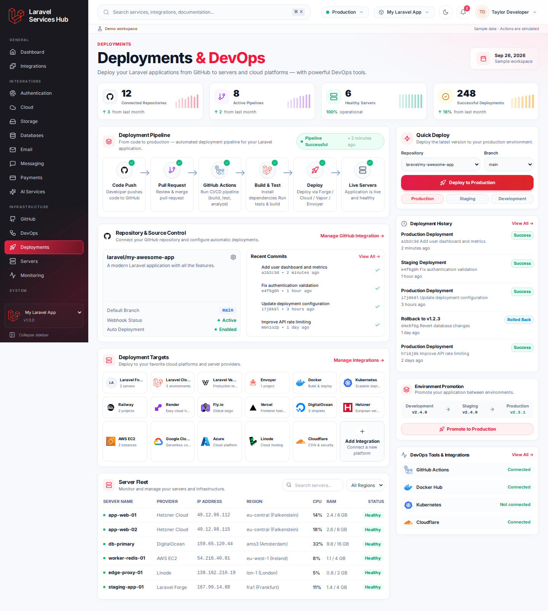
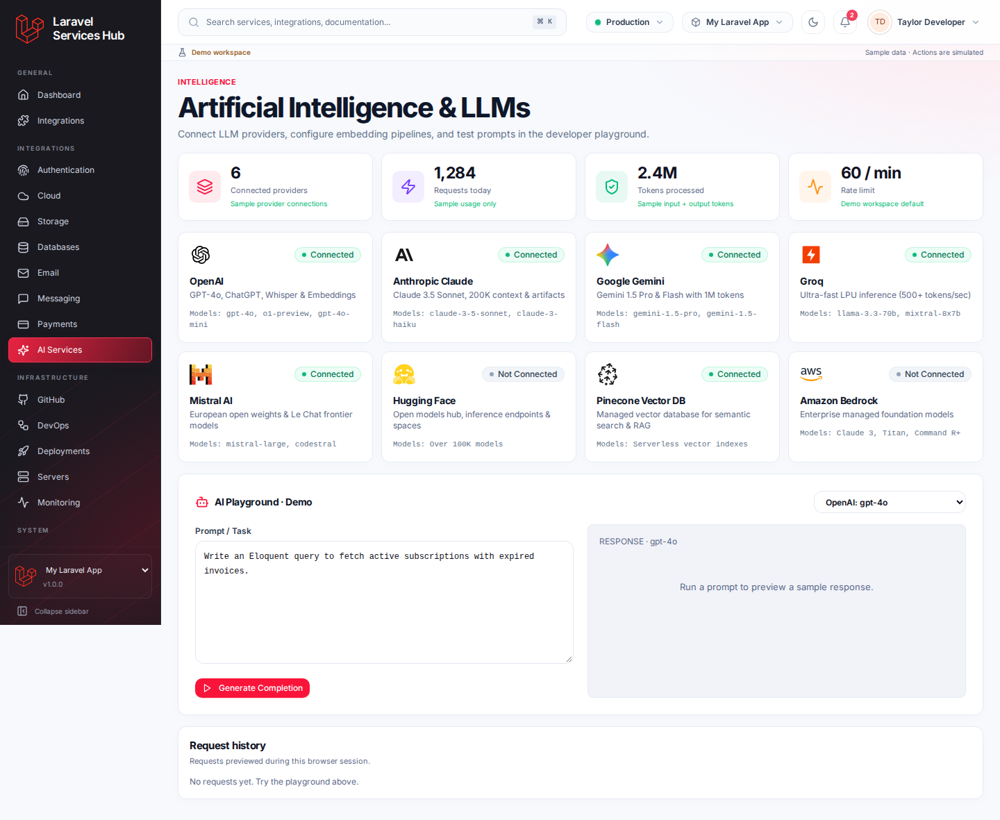
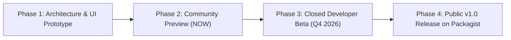

  

<h1 align="center">⚡ Laravel Services Hub ⚡</h1>
<h3 align="center">The Ultimate All-in-One Cloud Services, Integrations & DevOps Control Plane for Modern Laravel Applications</h3>

  
  
  
  
  
  

  
  
  

---

### 🚨 **LAUNCHING SOON — STAY TUNED!** 🚨

> **Laravel Services** is an ambitious next-generation package and unified dashboard designed to bridge the gap between your Laravel code and the massive ecosystem of 100+ cloud providers, microservices, AI platforms, and DevOps workflows.
> 
> Stop juggling 50 different API keys, inconsistent `.env` files, disconnected cloud consoles, and scattered deployment webhooks. Manage everything seamlessly from your Laravel app.

⭐ **[Star the Repository](https://github.com/a4hmad1/Laravel-Services.git)** to be the first to know when the Public Beta drops!

---

## 📸 Sneak Peek & Visual Tour

### 🖥️ 1. Unified Services Command Center
> Real-time monitoring, connected services metrics, one-click service dispatch, and quick operational actions directly inside your application.

  

---

### 🔌 2. The 108+ Services & Integrations Marketplace
> 13 dedicated categories: Cloud Infrastructure, AI Engines, Payments, Email, Storage, Databases, Authentication, Queues, Messaging, DevOps, Security, and Monitoring.

  

---

### 🚀 3. DevOps, CI/CD Pipeline & Multi-Cloud Server Fleet
> Seamless orchestration from Git push to GitHub Actions, automated staging/production promotion, and server fleet health tracking across Hetzner, AWS, DigitalOcean, and Laravel Forge.

  

---

### 🤖 4. Native AI & LLM Service Hub
> Plug-and-play multimodal AI integrations — OpenAI (GPT-4o), Anthropic (Claude 3.5), Google Gemini 2.0, Groq, Mistral, and Pinecone vector search with unified token tracking and prompt caching.

  

---

## ✨ Key Highlights & What's Coming

| Feature | Description | Status |
| :--- | :--- | :---: |
| 🧩 **108+ Pre-Built Integrations** | Out-of-the-box drivers and UI wizards for AWS, GCP, Cloudflare, Stripe, Resend, Redis, and more | 🟡 In Polish |
| 🛡️ **Zero-Drift Environment Sync** | Bi-directional `.env` sync, team secrets vault, and schema validation with rollback safety | 🟡 In Testing |
| ⚡ **One-Click Wizard Setup** | Interactive credentials validation and automated test-ping before saving config | 🟢 Ready |
| 🚢 **DevOps & Fleet Management** | Monitor multi-cloud servers (Hetzner, AWS EC2, DigitalOcean, Linode) alongside Laravel Forge/Vapor/Cloud | 🟢 Ready |
| 🤖 **Unified AI Gateway** | Switch effortlessly between OpenAI, Claude, Gemini, and Groq with unified fallback drivers | 🟢 Ready |
| 📊 **Deep Telemetry & Observability** | Integrated health checks, response latency heatmaps, queue latency, and webhook debugging | 🟡 In Polish |
| 🔔 **Real-Time Webhook Engine** | Inspect, replay, and simulate webhooks with verified cryptographic signatures | 🟡 In Polish |
| 🎨 **Laravel-Native Blade / React / Vue** | Ships with clean Blade components, Inertia.js bridges, and standalone single-page dashboard | 🟢 Ready |

---

## 🏗️ Supported Ecosystem & Integrations Catalog

<b>Click to expand the 13 Integration Categories (108+ Providers)</b>

 

* 🧠 **Artificial Intelligence**: OpenAI, Anthropic Claude, Google Gemini, Groq, Mistral AI, Hugging Face, Pinecone Vector DB
* ☁️ **Cloud Providers**: Amazon Web Services (AWS), Google Cloud Platform (GCP), Microsoft Azure, Cloudflare, Firebase
* 💳 **Payments & Billing**: Stripe, PayPal, Lemon Squeezy, Paddle, Adyen, Mollie, Razorpay, Square
* 📬 **Email & Transactional Delivery**: Resend, Postmark, AWS SES, Mailgun, SendGrid, Custom SMTP
* 🗄️ **Databases & Caching**: Redis, Supabase, PlanetScale, Neon Serverless Postgres, MongoDB, MySQL, PostgreSQL
* 📦 **Storage & CDN**: AWS S3, Cloudflare R2, Backblaze B2, Azure Blob Storage, Local Filesystem
* 🔐 **Authentication & IAM**: GitHub OAuth, Google OAuth, AWS IAM, Firebase Auth, Keycloak, Auth0, Discord OAuth, Apple Sign-In
* 📨 **Messaging & Webhooks**: Twilio, Telegram Bot, Slack Notifications, WhatsApp Business, Discord Bot, Pusher, Vonage
* 🛠️ **DevOps & CI/CD**: GitHub Actions, Docker, Kubernetes, Terraform, Ansible, GitLab CI
* 🖥️ **Server Platforms**: Laravel Forge, Laravel Cloud, Laravel Vapor, Laravel Envoyer, Fly.io, Railway, Render, Hetzner Cloud, DigitalOcean, Linode / Akamai, Vercel
* 📈 **Monitoring & Observability**: Sentry, Datadog, Better Stack, New Relic, Grafana, Prometheus, Bugsnag, CloudWatch
* 🛡️ **Security & Secrets**: Cloudflare Turnstile, Google reCAPTCHA, HashiCorp Vault, AWS KMS, AWS Secrets Manager
* ⚡ **Laravel Native**: Laravel Horizon, Laravel Sanctum, Laravel Pulse, Laravel Telescope

---

## 🗺️ Release Roadmap

- [x] **Phase 1: Core Dashboard & Interactive UI** *(Completed)*
- [x] **Phase 2: Registry of 108+ Service Adapters** *(Completed)*
- [ ] **Phase 3: Closed Developer Beta & Community Feedback** *(Current Step)*
- [ ] **Phase 4: Composer Package Distribution (`composer require laravel-services/hub`)**
- [ ] **Phase 5: Official Documentation Site & Video Tutorials**

---

## 📣 Laravel Community Shoutouts & Mentions

Huge inspiration and salute to the visionaries, creators, and maintainers who make the Laravel and PHP ecosystem the greatest developer community on Earth:

### 👑 Creators & Leaders
* **Taylor Otwell** ([@taylorotwell](https://github.com/taylorotwell)) – Creator of **Laravel**, Forge, Vapor, and Laravel Cloud
* **Freek Van der Herten** ([@freekmurze](https://github.com/freekmurze)) & the **Spatie** Team ([@spatie](https://github.com/spatie)) – The kings of open-source Laravel packages
* **Caleb Porzio** ([@calebporzio](https://github.com/calebporzio)) – Creator of **Livewire** & Alpine.js
* **Nuno Maduro** ([@nunomaduro](https://github.com/nunomaduro)) – Creator of **Pest PHP**, Collision, Termwind
* **Jonathan Reinink** ([@reinink](https://github.com/reinink)) – Creator of **Inertia.js**
* **Dries Vints** ([@driesvints](https://github.com/driesvints)) – Laravel Core Team, EventSauce
* **Mohamed Said** ([@themsaid](https://github.com/themsaid)) – Laravel Core Alum & Master of Horizon/Telescope
* **Aaron Francis** ([@aarondfrancis](https://github.com/aarondfrancis)) – High Performance SQLite & Hard Copy
* **Adam Wathan** ([@adamwathan](https://github.com/adamwathan)) – Creator of **Tailwind CSS**
* **Dan Harrin** ([@danharrin](https://github.com/danharrin)) & **Filament Team** ([@filamentphp](https://github.com/filamentphp)) – The TALL Stack & Filament Revolution

### 🏢 Companies & Open-Source Organizations Powering Laravel
* **Laravel** ([@laravel](https://github.com/laravel))
* **Spatie** ([@spatie](https://github.com/spatie))
* **Laracasts** ([@laracasts](https://github.com/laracasts) / Jeffrey Way)
* **Beyond Code** ([@beyondcode](https://github.com/beyondcode) / Marcel Pociot)
* **Tighten** ([@tighten](https://github.com/tighten))
* **ServerSideUp** ([@serversideup](https://github.com/serversideup))
* **Statamic** ([@statamic](https://github.com/statamic))
* **Pest PHP** ([@pestphp](https://github.com/pestphp))
* **Inertia.js** ([@inertiajs](https://github.com/inertiajs))
* **Livewire** ([@livewire](https://github.com/livewire))

---

## 💬 Join the Discussion & Early Access

Are there specific services or custom drivers you would like to see in v1.0? We would love your input!

- ⭐️ **Star & Watch**: Click the **Star** button above to receive notifications on repository activity!
- 💡 **Feature Requests**: Head over to [GitHub Discussions / Issues](https://github.com/a4hmad1/Laravel-Services/issues) to suggest integrations.
- 🐦 **Share the News**: Spread the word on [X (Twitter)](https://twitter.com/intent/tweet?text=Excited%20for%20the%20upcoming%20Laravel-Services%20hub%20by%20@a4hmad1!%20Check%20it%20out:%20https://github.com/a4hmad1/Laravel-Services.git&hashtags=Laravel,PHP,WebDev,OpenSource) and LinkedIn!

---

## 🏷️ Tags & Ecosystem Keywords

`#laravel` `#php` `#laravel11` `#laravel12` `#fullstack` `#webdevelopment` `#saas` `#cloud` `#devops` `#microservices` `#apis` `#ai` `#openai` `#anthropic` `#aws` `#cloudflare` `#stripe` `#hetzner` `#digitalocean` `#docker` `#composer` `#opensource` `#taylorotwell` `#spatie` `#livewire` `#inertiajs`

---

  <b>Built with ❤️ for the global Laravel community.</b> 
  Repository: <a href="https://github.com/a4hmad1/Laravel-Services.git">https://github.com/a4hmad1/Laravel-Services.git</a>

  © 2026 Ahmad (<a href="https://github.com/a4hmad1">@a4hmad1</a>). All rights reserved. Laravel is a registered trademark of Taylor Otwell.

