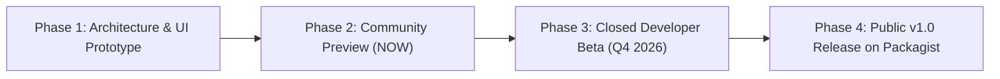

  

<h1 align="center">⚡ Laravel Services Hub ⚡</h1>
<h3 align="center">The Ultimate All-in-One Cloud Services, Integrations & DevOps Control Plane for Modern Laravel Applications</h3>

  
  
  
  
  
  

  
  
  

---

### 🚨 **LAUNCHING SOON — STAY TUNED!** 🚨

> **Laravel Services** is an ambitious next-generation package and unified dashboard designed to bridge the gap between your Laravel code and the massive ecosystem of 100+ cloud providers, microservices, AI platforms, and DevOps workflows.
> 
> Stop juggling 50 different API keys, inconsistent `.env` files, disconnected cloud consoles, and scattered deployment webhooks. Manage everything seamlessly from your Laravel app.

⭐ **[Star the Repository](https://github.com/a4hmad1/Laravel-Services.git)** to be the first to know when the Public Beta drops!

---

## 📸 Sneak Peek & Visual Tour

### 🖥️ 1. Unified Services Command Center
> Real-time monitoring, connected services metrics, one-click service dispatch, and quick operational actions directly inside your application.

  

---

### 🔌 2. The 108+ Services & Integrations Marketplace
> 13 dedicated categories: Cloud Infrastructure, AI Engines, Payments, Email, Storage, Databases, Authentication, Queues, Messaging, DevOps, Security, and Monitoring.

  

---

### 🚀 3. DevOps, CI/CD Pipeline & Multi-Cloud Server Fleet
> Seamless orchestration from Git push to GitHub Actions, automated staging/production promotion, and server fleet health tracking across Hetzner, AWS, DigitalOcean, and Laravel Forge.

  

---

### 🤖 4. Native AI & LLM Service Hub
> Plug-and-play multimodal AI integrations — OpenAI (GPT-4o), Anthropic (Claude 3.5), Google Gemini 2.0, Groq, Mistral, and Pinecone vector search with unified token tracking and prompt caching.

  

---

## ✨ Key Highlights & What's Coming

| Feature | Description | Status |
| :--- | :--- | :---: |
| 🧩 **108+ Pre-Built Integrations** | Out-of-the-box drivers and UI wizards for AWS, GCP, Cloudflare, Stripe, Resend, Redis, and more | 🟡 In Polish |
| 🛡️ **Zero-Drift Environment Sync** | Bi-directional `.env` sync, team secrets vault, and schema validation with rollback safety | 🟡 In Testing |
| ⚡ **One-Click Wizard Setup** | Interactive credentials validation and automated test-ping before saving config | 🟢 Ready |
| 🚢 **DevOps & Fleet Management** | Monitor multi-cloud servers (Hetzner, AWS EC2, DigitalOcean, Linode) alongside Laravel Forge/Vapor/Cloud | 🟢 Ready |
| 🤖 **Unified AI Gateway** | Switch effortlessly between OpenAI, Claude, Gemini, and Groq with unified fallback drivers | 🟢 Ready |
| 📊 **Deep Telemetry & Observability** | Integrated health checks, response latency heatmaps, queue latency, and webhook debugging | 🟡 In Polish |
| 🔔 **Real-Time Webhook Engine** | Inspect, replay, and simulate webhooks with verified cryptographic signatures | 🟡 In Polish |
| 🎨 **Laravel-Native Blade / React / Vue** | Ships with clean Blade components, Inertia.js bridges, and standalone single-page dashboard | 🟢 Ready |

---

## 🏗️ Supported Ecosystem & Integrations Catalog

<b>Click to expand the 13 Integration Categories (108+ Providers)</b>

 

* 🧠 **Artificial Intelligence**: OpenAI, Anthropic Claude, Google Gemini, Groq, Mistral AI, Hugging Face, Pinecone Vector DB
* ☁️ **Cloud Providers**: Amazon Web Services (AWS), Google Cloud Platform (GCP), Microsoft Azure, Cloudflare, Firebase
* 💳 **Payments & Billing**: Stripe, PayPal, Lemon Squeezy, Paddle, Adyen, Mollie, Razorpay, Square
* 📬 **Email & Transactional Delivery**: Resend, Postmark, AWS SES, Mailgun, SendGrid, Custom SMTP
* 🗄️ **Databases & Caching**: Redis, Supabase, PlanetScale, Neon Serverless Postgres, MongoDB, MySQL, PostgreSQL
* 📦 **Storage & CDN**: AWS S3, Cloudflare R2, Backblaze B2, Azure Blob Storage, Local Filesystem
* 🔐 **Authentication & IAM**: GitHub OAuth, Google OAuth, AWS IAM, Firebase Auth, Keycloak, Auth0, Discord OAuth, Apple Sign-In
* 📨 **Messaging & Webhooks**: Twilio, Telegram Bot, Slack Notifications, WhatsApp Business, Discord Bot, Pusher, Vonage
* 🛠️ **DevOps & CI/CD**: GitHub Actions, Docker, Kubernetes, Terraform, Ansible, GitLab CI
* 🖥️ **Server Platforms**: Laravel Forge, Laravel Cloud, Laravel Vapor, Laravel Envoyer, Fly.io, Railway, Render, Hetzner Cloud, DigitalOcean, Linode / Akamai, Vercel
* 📈 **Monitoring & Observability**: Sentry, Datadog, Better Stack, New Relic, Grafana, Prometheus, Bugsnag, CloudWatch
* 🛡️ **Security & Secrets**: Cloudflare Turnstile, Google reCAPTCHA, HashiCorp Vault, AWS KMS, AWS Secrets Manager
* ⚡ **Laravel Native**: Laravel Horizon, Laravel Sanctum, Laravel Pulse, Laravel Telescope

---

## 🗺️ Release Roadmap

- [x] **Phase 1: Core Dashboard & Interactive UI** *(Completed)*
- [x] **Phase 2: Registry of 108+ Service Adapters** *(Completed)*
- [ ] **Phase 3: Closed Developer Beta & Community Feedback** *(Current Step)*
- [ ] **Phase 4: Composer Package Distribution (`composer require laravel-services/hub`)**
- [ ] **Phase 5: Official Documentation Site & Video Tutorials**

---

## 📣 Laravel Community Shoutouts & Mentions

Huge inspiration and salute to the visionaries, creators, and maintainers who make the Laravel and PHP ecosystem the greatest developer community on Earth:

### 🌟 Popular Laravel Developers & Innovators

<table align="center" width="100%">
  <tr>
    <td align="center" width="25%" valign="top">
      <a href="https://github.com/taylorotwell">
         
        <b>Taylor Otwell</b>
      </a> 
      <a href="https://github.com/taylorotwell">@taylorotwell</a> 
      <i>Creator of Laravel, Forge & Vapor</i>
    </td>
    <td align="center" width="25%" valign="top">
      <a href="https://github.com/freekmurze">
         
        <b>Freek Van der Herten</b>
      </a> 
      <a href="https://github.com/freekmurze">@freekmurze</a> 
      <i>Spatie Co-Founder & Package Maestro</i>
    </td>
    <td align="center" width="25%" valign="top">
      <a href="https://github.com/calebporzio">
         
        <b>Caleb Porzio</b>
      </a> 
      <a href="https://github.com/calebporzio">@calebporzio</a> 
      <i>Creator of Livewire & Alpine.js</i>
    </td>
    <td align="center" width="25%" valign="top">
      <a href="https://github.com/nunomaduro">
         
        <b>Nuno Maduro</b>
      </a> 
      <a href="https://github.com/nunomaduro">@nunomaduro</a> 
      <i>Creator of Pest PHP & Termwind</i>
    </td>
  </tr>
  <tr>
    <td align="center" width="25%" valign="top">
      <a href="https://github.com/jeffreyway">
         
        <b>Jeffrey Way</b>
      </a> 
      <a href="https://github.com/jeffreyway">@jeffreyway</a> 
      <i>Founder of Laracasts & Educator</i>
    </td>
    <td align="center" width="25%" valign="top">
      <a href="https://github.com/mattstauffer">
         
        <b>Matt Stauffer</b>
      </a> 
      <a href="https://github.com/mattstauffer">@mattstauffer</a> 
      <i>Tighten Co-Founder & Author</i>
    </td>
    <td align="center" width="25%" valign="top">
      <a href="https://github.com/reinink">
         
        <b>Jonathan Reinink</b>
      </a> 
      <a href="https://github.com/reinink">@reinink</a> 
      <i>Creator of Inertia.js</i>
    </td>
    <td align="center" width="25%" valign="top">
      <a href="https://github.com/mpociot">
         
        <b>Marcel Pociot</b>
      </a> 
      <a href="https://github.com/mpociot">@mpociot</a> 
      <i>Creator of NativePHP & Beyond Code</i>
    </td>
  </tr>
  <tr>
    <td align="center" width="25%" valign="top">
      <a href="https://github.com/danharrin">
         
        <b>Dan Harrin</b>
      </a> 
      <a href="https://github.com/danharrin">@danharrin</a> 
      <i>Lead Creator of Filament</i>
    </td>
    <td align="center" width="25%" valign="top">
      <a href="https://github.com/adamwathan">
         
        <b>Adam Wathan</b>
      </a> 
      <a href="https://github.com/adamwathan">@adamwathan</a> 
      <i>Creator of Tailwind CSS</i>
    </td>
    <td align="center" width="25%" valign="top">
      <a href="https://github.com/jessarcher">
         
        <b>Jess Archer</b>
      </a> 
      <a href="https://github.com/jessarcher">@jessarcher</a> 
      <i>Laravel Core Team & Prompts</i>
    </td>
    <td align="center" width="25%" valign="top">
      <a href="https://github.com/driesvints">
         
        <b>Dries Vints</b>
      </a> 
      <a href="https://github.com/driesvints">@driesvints</a> 
      <i>Laravel Core Team & EventSauce</i>
    </td>
  </tr>
  <tr>
    <td align="center" width="25%" valign="top">
      <a href="https://github.com/themsaid">
         
        <b>Mohamed Said</b>
      </a> 
      <a href="https://github.com/themsaid">@themsaid</a> 
      <i>Laravel Horizon & Telescope Alum</i>
    </td>
    <td align="center" width="25%" valign="top">
      <a href="https://github.com/aarondfrancis">
         
        <b>Aaron Francis</b>
      </a> 
      <a href="https://github.com/aarondfrancis">@aarondfrancis</a> 
      <i>High Performance SQLite & Hard Copy</i>
    </td>
    <td align="center" width="25%" valign="top">
      <a href="https://github.com/jasonmccreary">
         
        <b>Jason McCreary</b>
      </a> 
      <a href="https://github.com/jasonmccreary">@jasonmccreary</a> 
      <i>Creator of Laravel Shift</i>
    </td>
    <td align="center" width="25%" valign="top">
      <a href="https://github.com/GrahamCampbell">
         
        <b>Graham Campbell</b>
      </a> 
      <a href="https://github.com/GrahamCampbell">@GrahamCampbell</a> 
      <i>StyleCI Founder & Top Contributor</i>
    </td>
  </tr>
  <tr>
    <td align="center" width="25%" valign="top">
      <a href="https://github.com/timacdonald">
         
        <b>Tim MacDonald</b>
      </a> 
      <a href="https://github.com/timacdonald">@timacdonald</a> 
      <i>Laravel Core Team Member</i>
    </td>
    <td align="center" width="25%" valign="top">
      <a href="https://github.com/christophrumpel">
         
        <b>Christoph Rumpel</b>
      </a> 
      <a href="https://github.com/christophrumpel">@christophrumpel</a> 
      <i>Laravel Educator & Author</i>
    </td>
    <td align="center" width="25%" valign="top">
      <a href="https://github.com/brendt">
         
        <b>Brent Roose</b>
      </a> 
      <a href="https://github.com/brendt">@brendt</a> 
      <i>Stitcher.io & PHP Foundation</i>
    </td>
    <td align="center" width="25%" valign="top">
      <a href="https://github.com/bobbybouwmann">
         
        <b>Bobby Bouwmann</b>
      </a> 
      <a href="https://github.com/bobbybouwmann">@bobbybouwmann</a> 
      <i>Laravel Veteran & Speaker</i>
    </td>
  </tr>
  <tr>
    <td align="center" width="25%" valign="top">
      <a href="https://github.com/crynobone">
         
        <b>Mior Muhammad Zaki</b>
      </a> 
      <a href="https://github.com/crynobone">@crynobone</a> 
      <i>Creator of Orchestra Testbench</i>
    </td>
    <td align="center" width="25%" valign="top">
      <a href="https://github.com/joedixon">
         
        <b>Joe Dixon</b>
      </a> 
      <a href="https://github.com/joedixon">@joedixon</a> 
      <i>Laravel Core Team Member</i>
    </td>
    <td align="center" width="25%" valign="top">
      <a href="https://github.com/tonysm">
         
        <b>Tony Messias</b>
      </a> 
      <a href="https://github.com/tonysm">@tonysm</a> 
      <i>Creator of Turbo Laravel</i>
    </td>
    <td align="center" width="25%" valign="top">
      <a href="https://github.com/lukeraymonddowning">
         
        <b>Luke Downing</b>
      </a> 
      <a href="https://github.com/lukeraymonddowning">@lukeraymonddowning</a> 
      <i>Pest Core Team & Educator</i>
    </td>
  </tr>
  <tr>
    <td align="center" width="25%" valign="top">
      <a href="https://github.com/sebastiandedeyne">
         
        <b>Sebastian De Deyne</b>
      </a> 
      <a href="https://github.com/sebastiandedeyne">@sebastiandedeyne</a> 
      <i>Spatie Partner & Frontend Architect</i>
    </td>
    <td align="center" width="25%" valign="top">
      <a href="https://github.com/jbrooksuk">
         
        <b>James Brooks</b>
      </a> 
      <a href="https://github.com/jbrooksuk">@jbrooksuk</a> 
      <i>Laravel Core Team & Cachet Creator</i>
    </td>
    <td align="center" width="25%" valign="top">
      <a href="https://github.com/mateusjatenee">
         
        <b>Mateus Guimarães</b>
      </a> 
      <a href="https://github.com/mateusjatenee">@mateusjatenee</a> 
      <i>Pest PHP & Open Source Contributor</i>
    </td>
    <td align="center" width="25%" valign="top">
      <a href="https://github.com/alexgarrett">
         
        <b>Alex Garrett-Smith</b>
      </a> 
      <a href="https://github.com/alexgarrett">@alexgarrett</a> 
      <i>Codecourse Founder & Educator</i>
    </td>
  </tr>
</table>

### 🏢 Companies & Open-Source Studios

<table align="center" width="100%">
  <tr>
    <td align="center" width="25%" valign="top">
      <a href="https://github.com/laravel">
         
        <b>Laravel LLC</b>
      </a> 
      <a href="https://github.com/laravel">@laravel</a> 
      <i>The PHP Framework for Web Artisans</i>
    </td>
    <td align="center" width="25%" valign="top">
      <a href="https://github.com/spatie">
         
        <b>Spatie</b>
      </a> 
      <a href="https://github.com/spatie">@spatie</a> 
      <i>The Open Source Package Kings</i>
    </td>
    <td align="center" width="25%" valign="top">
      <a href="https://github.com/laracasts">
         
        <b>Laracasts</b>
      </a> 
      <a href="https://github.com/laracasts">@laracasts</a> 
      <i>The Best Web Development Tutorials</i>
    </td>
    <td align="center" width="25%" valign="top">
      <a href="https://github.com/filamentphp">
         
        <b>Filament PHP</b>
      </a> 
      <a href="https://github.com/filamentphp">@filamentphp</a> 
      <i>TALL Stack Admin Panel & Form Builder</i>
    </td>
  </tr>
  <tr>
    <td align="center" width="25%" valign="top">
      <a href="https://github.com/beyondcode">
         
        <b>Beyond Code</b>
      </a> 
      <a href="https://github.com/beyondcode">@beyondcode</a> 
      <i>NativePHP, Tinkerwell & Dev Tools</i>
    </td>
    <td align="center" width="25%" valign="top">
      <a href="https://github.com/tighten">
         
        <b>Tighten</b>
      </a> 
      <a href="https://github.com/tighten">@tighten</a> 
      <i>World-Class Laravel Consulting & Tooling</i>
    </td>
    <td align="center" width="25%" valign="top">
      <a href="https://github.com/pestphp">
         
        <b>Pest PHP</b>
      </a> 
      <a href="https://github.com/pestphp">@pestphp</a> 
      <i>An Elegant Testing Framework</i>
    </td>
    <td align="center" width="25%" valign="top">
      <a href="https://github.com/livewire">
         
        <b>Livewire</b>
      </a> 
      <a href="https://github.com/livewire">@livewire</a> 
      <i>Full-Stack Framework for Laravel</i>
    </td>
  </tr>
  <tr>
    <td align="center" width="25%" valign="top">
      <a href="https://github.com/inertiajs">
         
        <b>Inertia.js</b>
      </a> 
      <a href="https://github.com/inertiajs">@inertiajs</a> 
      <i>The Modern Monolith Architecture</i>
    </td>
    <td align="center" width="25%" valign="top">
      <a href="https://github.com/serversideup">
         
        <b>ServerSideUp</b>
      </a> 
      <a href="https://github.com/serversideup">@serversideup</a> 
      <i>Production-Ready Docker Images for PHP</i>
    </td>
    <td align="center" width="25%" valign="top">
      <a href="https://github.com/statamic">
         
        <b>Statamic</b>
      </a> 
      <a href="https://github.com/statamic">@statamic</a> 
      <i>The Flat-First Laravel CMS</i>
    </td>
    <td align="center" width="25%" valign="top">
      <a href="https://github.com/laravel-zero">
         
        <b>Laravel Zero</b>
      </a> 
      <a href="https://github.com/laravel-zero">@laravel-zero</a> 
      <i>Micro-framework for Console Apps</i>
    </td>
  </tr>
</table>

### 👥 Detailed Tagged Breakdown & Contributions

<b>Click to toggle individual developer profiles & tags</b>

 

#### 👑 Core Team & Framework Architects
*  **Taylor Otwell** ([@taylorotwell](https://github.com/taylorotwell)) – Creator of **Laravel**, Forge, Vapor, Envoyer & Laravel Cloud
*  **Dries Vints** ([@driesvints](https://github.com/driesvints)) – Laravel Core Team, EventSauce maintainer & Laravel.io
*  **Mohamed Said** ([@themsaid](https://github.com/themsaid)) – Laravel Core Alum, Master of Horizon, Telescope & Pulse
*  **Jess Archer** ([@jessarcher](https://github.com/jessarcher)) – Laravel Core Team, Creator of Laravel Prompts & Herd macOS/Windows
*  **Tim MacDonald** ([@timacdonald](https://github.com/timacdonald)) – Laravel Core Team Member & Package Author
*  **Joe Dixon** ([@joedixon](https://github.com/joedixon)) – Laravel Core Team Member & Dev Lead
*  **James Brooks** ([@jbrooksuk](https://github.com/jbrooksuk)) – Laravel Core Team Member & Creator of Cachet
*  **Graham Campbell** ([@GrahamCampbell](https://github.com/GrahamCampbell)) – StyleCI Founder, PHP-CS-Fixer core & #1 Laravel Core Contributor

#### ⚡ Full-Stack, TALL Stack & UI Pioneers
*  **Caleb Porzio** ([@calebporzio](https://github.com/calebporzio)) – Creator of **Livewire** & **Alpine.js**
*  **Jonathan Reinink** ([@reinink](https://github.com/reinink)) – Creator of **Inertia.js**
*  **Adam Wathan** ([@adamwathan](https://github.com/adamwathan)) – Creator of **Tailwind CSS** & Full Stack Radio
*  **Dan Harrin** ([@danharrin](https://github.com/danharrin)) – Lead Creator of **Filament** & TALL Stack Pioneer
*  **Tony Messias** ([@tonysm](https://github.com/tonysm)) – Creator of **Turbo Laravel** & Hotwire for PHP

#### 🛠️ Open-Source Ecosystem & Tooling Titans
*  **Freek Van der Herten** ([@freekmurze](https://github.com/freekmurze)) – Co-Founder at **Spatie**, author of 300+ open-source Laravel packages
*  **Nuno Maduro** ([@nunomaduro](https://github.com/nunomaduro)) – Creator of **Pest PHP**, Collision, Termwind & Laravel Zero
*  **Marcel Pociot** ([@mpociot](https://github.com/mpociot)) – Creator of **NativePHP**, founder of **Beyond Code** (Tinkerwell, HELO, Invoker)
*  **Jason McCreary** ([@jasonmccreary](https://github.com/jasonmccreary)) – Creator of **Laravel Shift** & BaseCode
*  **Mior Muhammad Zaki** ([@crynobone](https://github.com/crynobone)) – Creator of **Orchestra Testbench** (the bedrock of Laravel package testing)
*  **Sebastian De Deyne** ([@sebastiandedeyne](https://github.com/sebastiandedeyne)) – Partner at **Spatie**, frontend architect & Laravel package contributor
*  **Luke Downing** ([@lukeraymonddowning](https://github.com/lukeraymonddowning)) – Pest PHP Core Team Member & Laravel Educator
*  **Mateus Guimarães** ([@mateusjatenee](https://github.com/mateusjatenee)) – Pest PHP contributor & developer advocate

#### 🎓 Educators, Community Leaders & Authors
*  **Jeffrey Way** ([@jeffreyway](https://github.com/jeffreyway)) – Founder of **Laracasts**, legendary PHP & Laravel educator
*  **Matt Stauffer** ([@mattstauffer](https://github.com/mattstauffer)) – Co-Founder at **Tighten**, author of *Laravel: Up & Running*, host of *The Laravel Podcast*
*  **Aaron Francis** ([@aarondfrancis](https://github.com/aarondfrancis)) – High Performance SQLite, Hard Copy, Try Hard Studios & Educator
*  **Christoph Rumpel** ([@christophrumpel](https://github.com/christophrumpel)) – Laravel Educator, author of *Mastering PhpStorm*, Pest contributor & speaker
*  **Brent Roose** ([@brendt](https://github.com/brendt)) – Stitcher.io, PHP Foundation advocate & former Spatie developer
*  **Bobby Bouwmann** ([@bobbybouwmann](https://github.com/bobbybouwmann)) – Laravel veteran, Laracasts Hall of Fame, speaker & package creator
*  **Alex Garrett-Smith** ([@alexgarrett](https://github.com/alexgarrett)) – Founder of **Codecourse** & prolific Laravel tutorial author

---

## 💬 Join the Discussion & Early Access

Are there specific services or custom drivers you would like to see in v1.0? We would love your input!

- ⭐️ **Star & Watch**: Click the **Star** button above to receive notifications on repository activity!
- 💡 **Feature Requests**: Head over to [GitHub Discussions / Issues](https://github.com/a4hmad1/Laravel-Services/issues) to suggest integrations.
- 🐦 **Share the News**: Spread the word on [X (Twitter)](https://twitter.com/intent/tweet?text=Excited%20for%20the%20upcoming%20Laravel-Services%20hub%20by%20@a4hmad1!%20Check%20it%20out:%20https://github.com/a4hmad1/Laravel-Services.git&hashtags=Laravel,PHP,WebDev,OpenSource) and LinkedIn!

---

## 🏷️ Tags & Ecosystem Keywords

`#laravel` `#php` `#laravel11` `#laravel12` `#fullstack` `#webdevelopment` `#saas` `#cloud` `#devops` `#microservices` `#apis` `#ai` `#openai` `#anthropic` `#aws` `#cloudflare` `#stripe` `#hetzner` `#digitalocean` `#docker` `#composer` `#opensource` `#taylorotwell` `#freekmurze` `#spatie` `#livewire` `#calebporzio` `#inertiajs` `#reinink` `#nunomaduro` `#pestphp` `#laracasts` `#jeffreyway` `#filamentphp` `#danharrin` `#nativephp` `#mpociot` `#beyondcode` `#tighten` `#mattstauffer` `#aarondfrancis` `#themsaid` `#driesvints` `#jasonmccreary`

---

  <b>Built with ❤️ for the global Laravel community.</b> 
  Repository: <a href="https://github.com/a4hmad1/Laravel-Services.git">https://github.com/a4hmad1/Laravel-Services.git</a>

  © 2026 Ahmad (<a href="https://github.com/a4hmad1">@a4hmad1</a>). All rights reserved. Laravel is a registered trademark of Taylor Otwell.

